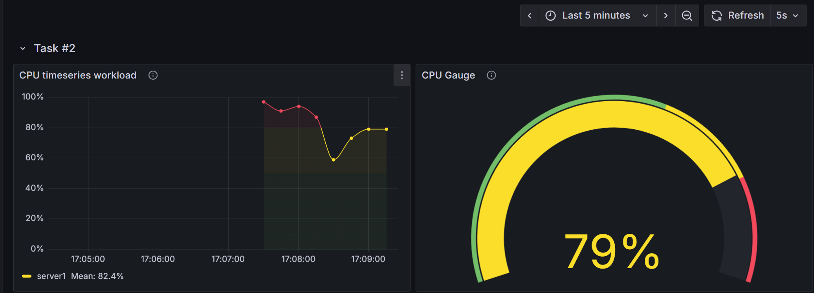

# Task #2
### Task: Prepare a Grafana dashboard for the cpu_usage metric

This repository contains files from original repo `demo-prometheus-and-grafana-alerts` + `dashboard-generator`,
that generates [dashboard.json](dashboard-generator/generated-dashboard/dashboard.json) for dashboard.
The generator creates a dashboard with two panels: Timeseries and GaugePanelBuilder.



To run this code, all you need to do is run the following command:
```
docker compose up
```
Everything is preconfigured in **Docker Compose**: Grafana, Prometheus, k6 test data generator, 
and the Dashboard Generator itself.

Just open Grafana with this link. **(Hint: the dashboard is located in MyFolder.)**
- Grafana: [http://localhost:3000](http://localhost:3000/)
- Dashboard directly [http://localhost:3000/d/generated-from-java/sample-dashboard](http://localhost:3000/d/generated-from-java/sample-dashboard)

## Dashboard editing
The dashboard can be edited via the code in the main class. Simply make the changes and run the compilation. 
After a few seconds, the changes should appear in Grafana.

- [Main.java](dashboard-generator/src/main/java/ch/unibe/Main.java)

- [dashboard.json](dashboard-generator/generated-dashboard/dashboard.json)